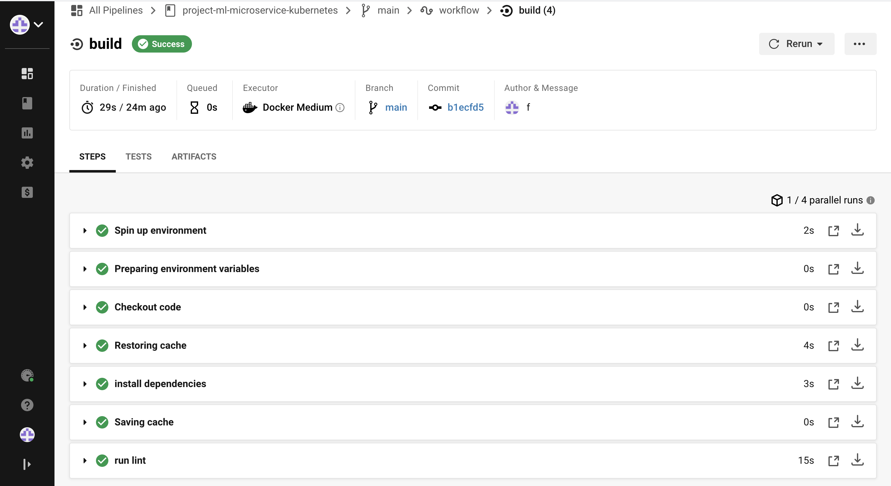

# Project Tasks

Your project goal is to operationalize this working, machine learning microservice using kubernetes, which is an open-source system for automating the management of containerized applications. In this project you will:
- Test your project code using linting
- Complete a Dockerfile to containerize this application
- Deploy your containerized application using Docker and make a prediction
- Improve the log statements in the source code for this application
- Configure Kubernetes and create a Kubernetes cluster
- Deploy a container using Kubernetes and make a prediction
- Upload a complete Github repo with CircleCI to indicate that your code has been tested

# POC
   
   
Docker Container Output Logs

```
 * Serving Flask app "app" (lazy loading)
 * Environment: production
   WARNING: Do not use the development server in a production environment.
   Use a production WSGI server instead.
 * Debug mode: on
 * Running on http://0.0.0.0:80/ (Press CTRL+C to quit)
 * Restarting with stat
 * Debugger is active!
 * Debugger PIN: 364-654-657
172.17.0.1 - - [29/Apr/2021 12:21:21] "GET / HTTP/1.1" 200 -
[2021-04-29 12:22:04,641] INFO in app: JSON payload: 
{'CHAS': {'0': 0}, 'RM': {'0': 6.575}, 'TAX': {'0': 296.0}, 'PTRATIO': {'0': 15.3}, 'B': {'0': 396.9}, 'LSTAT': {'0': 4.98}}
[2021-04-29 12:22:04,668] INFO in app: Inference payload DataFrame: 
   CHAS     RM    TAX  PTRATIO      B  LSTAT
0     0  6.575  296.0     15.3  396.9   4.98
[2021-04-29 12:22:04,685] INFO in app: Scaling Payload: 
   CHAS     RM    TAX  PTRATIO      B  LSTAT
0     0  6.575  296.0     15.3  396.9   4.98
172.17.0.1 - - [29/Apr/2021 12:22:04] "POST /predict HTTP/1.1" 200 -


[info]  Handling connection for 8000
[info] {
[info]  "prediction": [
[info]     20.35373177134412
[info]   ]
[info] }
```


K8S POD Output Logs
```
 * Serving Flask app "app" (lazy loading)
 * Environment: production
   WARNING: Do not use the development server in a production environment.
   Use a production WSGI server instead.
 * Debug mode: on
 * Running on http://0.0.0.0:80/ (Press CTRL+C to quit)
 * Restarting with stat
 * Debugger is active!
 * Debugger PIN: 212-162-687
[2021-04-29 13:13:08,960] INFO in app: JSON payload: 
{'CHAS': {'0': 0}, 'RM': {'0': 6.575}, 'TAX': {'0': 296.0}, 'PTRATIO': {'0': 15.3}, 'B': {'0': 396.9}, 'LSTAT': {'0': 4.98}}
[2021-04-29 13:13:08,976] INFO in app: Inference payload DataFrame: 
   CHAS     RM    TAX  PTRATIO      B  LSTAT
0     0  6.575  296.0     15.3  396.9   4.98
[2021-04-29 13:13:08,987] INFO in app: Scaling Payload: 
   CHAS     RM    TAX  PTRATIO      B  LSTAT
0     0  6.575  296.0     15.3  396.9   4.98
127.0.0.1 - - [29/Apr/2021 13:13:08] "POST /predict HTTP/1.1" 200 -
[info]  Handling connection for 8000
[info] {
[info]  "prediction": [
[info]     20.35373177134412
[info]   ]
[info] }
```
